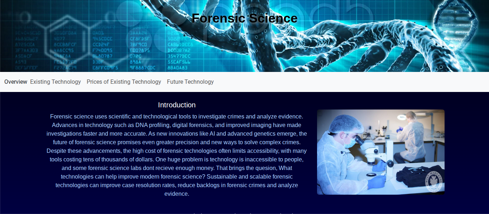
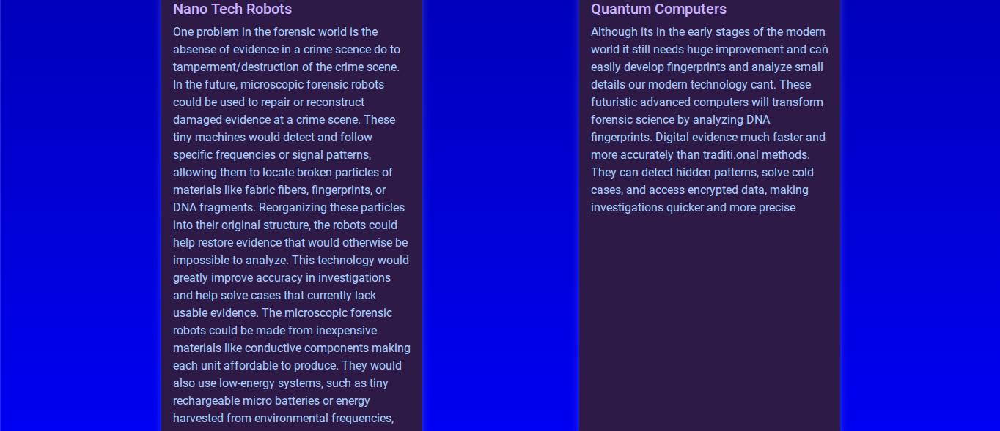

# Entry 6
##### 5/11/26

## Content
For this part of my Freedom Project, my website was based on forensic science, and I wanted to demonstrate my ideas for future technologies like nanotech robots and quantum computers. I based the project on the wireframe I had created, which helped me plan the layout and structure before adding any content. I included features like navbar links, accordions, and cards to organize information and make navigation clear and interactive. I chose black and dark blue colors to give the site a calm, focused feeling, almost like a laboratory where experiments and technology come together. Using the [wireframe](https://wireframe.cc/LjwreM) as a guide allowed me to focus on both functionality and visual design, ensuring the layout was easy to follow and visually cohesive. Overall, this project taught me the value of planning, organization, and attention to detail, and it gave me confidence in presenting complex ideas in a clear and engaging way. 

## EDP
For my Freedom Project, I used my wireframe and planning as a guide to develop my ideas about future technologies like nanotech robots and quantum computers. By mapping out the layout and structure beforehand, I could organize my thoughts clearly and decide where each part of my project would go. I used cards to describe each innovation, showing what the nanotech robots might look like and how they could operate in forensic science, and explaining how quantum computers could improve investigations. The wireframe helped me ensure that these ideas were presented in a logical and visually appealing way, making it easier for viewers to understand my concepts. Through this process, I learned how planning, design, and thoughtful organization can turn abstract ideas into a clear, interactive way

## Skills
#### Time Management
During this stage in my SEP 10 Freedom Project I improved my time management skills. I used my plan.md and timeline to decide when to add Bootstrap components, style my CSS, and include images, which helped me stay organized and ensure the website was completed step by step. Planning ahead made it easier to balance adding interactive features like cards and accordions while keeping the website functional.

#### Creativity
During this stage in my SEP 10 Freedom Project I improved my creativity. I had to design the website to be both professional and visually appealing, making sure the layout, colors, and components worked together to showcase my innovations like nanotech robots and quantum computers. I experimented with different cards, color schemes, and spacing to make the content engaging while still looking polished on phones and computers.

#### Problem Solving and Logical Reasoning
During this stage in my SEP 10 Freedom Project I improved my problem solving and logical reasoning. My website was often buggy because I was missing divs or misusing the grid, so I had to carefully debug and logically plan each section. I had to think about the structure of my Bootstrap grid and how each component fit together, ensuring users could navigate easily and understand my innovations clearly.

[Previous](entry05.md) | [Next](entry07.md)

[Home](../README.md)
